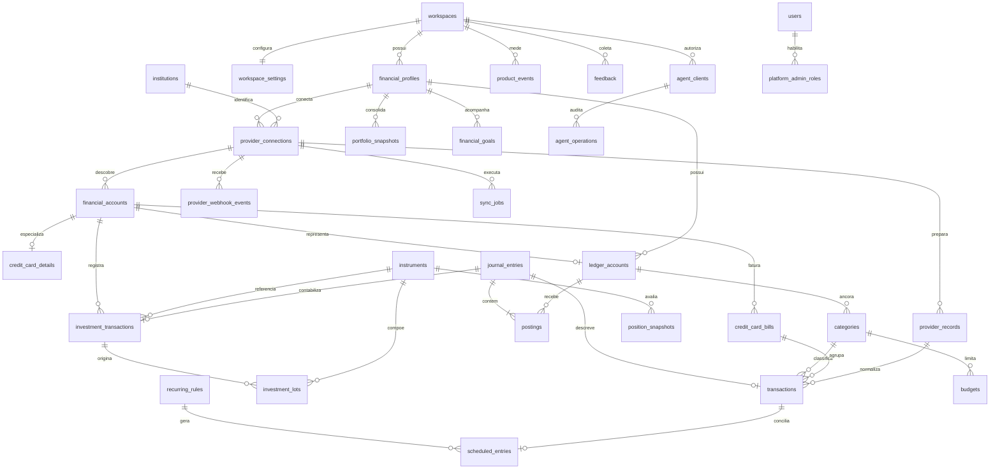

# Modelo de dados financeiro v1

Status: **definido no passo 2** em 17/09/2026.

## Objetivo

Este modelo transforma o Money Manager em um livro financeiro relacional. O
PostgreSQL é a fonte de verdade; integrações, interface e agentes escrevem pelos
mesmos serviços de aplicação. O schema é aditivo nesta etapa. A remoção das
tabelas antigas e do store JSON pertence ao passo 3.

## Regras fundamentais

- Todo dado privado pertence a um `workspace_id`.
- Valores monetários usam `bigint` na menor unidade da moeda. Para BRL, `100`
  significa R$ 1,00.
- Quantidades e preços de ativos usam `numeric(28,10)`.
- `postings.amount_minor` e `base_amount_minor` são assinados: débito positivo e
  crédito negativo.
- Um lançamento `posted` possui pelo menos duas partidas e soma
  `base_amount_minor = 0`.
- `financial_accounts.current_balance_minor` é cache da instituição. O saldo
  reconstruído do ledger é a fonte contábil.
- Posições, lotes e snapshots são projeções reconstruíveis a partir das
  operações e partidas.
- Payload bruto do provedor fica em `finance`, nunca no schema operacional.
- O schema `ops` não pode armazenar saldos, posições, valores ou descrições de
  transações.

## Limites dos schemas

| Schema | Responsabilidade |
|---|---|
| `public` | Identidade, autenticação, workspaces e perfis financeiros. |
| `finance` | Livro contábil, contas, cartões, investimentos, planejamento e ingestão. |
| `ops` | Telemetria, satisfação, acesso administrativo e auditoria técnica. |

Tabelas globais de catálogo: `finance.institutions` e
`finance.instruments`. As demais tabelas financeiras são isoladas por
workspace.

## Diagrama lógico



## Dicionário de dados

### Identidade e tenancy mantidos em `public`

| Tabela | Papel no modelo novo |
|---|---|
| `users` | Identidade humana e preferências do assistente. |
| `workspaces` | Fronteira de propriedade e isolamento. |
| `workspace_memberships` | Vínculo e papel do usuário no workspace. |
| `financial_profiles` | Pessoa, empresa ou dependente titular dos dados. |
| `user_sessions` | Sessões web revogáveis. |
| `external_identities` | Vínculo com canais externos. |
| `identity_link_codes` | Vinculação temporária e verificável de identidade. |

### Núcleo financeiro em `finance`

| Tabela | Fonte/derivada | Responsabilidade e invariantes principais |
|---|---|---|
| `workspace_settings` | Fonte | Moeda-base e timezone do workspace. |
| `institutions` | Catálogo global | Bancos e corretoras, identificados por código único. |
| `financial_accounts` | Fonte | Conta bancária, caixa, cartão, investimento ou dívida. Identidade externa é única por conexão. |
| `credit_card_details` | Fonte | Fechamento, vencimento e limites de uma conta do tipo cartão. |
| `ledger_accounts` | Fonte | Plano de contas por classe contábil; código único por workspace. |
| `categories` | Fonte | Classificação de receitas e despesas ligada a uma conta contábil. |
| `journal_entries` | Fonte contábil | Cabeçalho imutável logicamente de um evento financeiro. Reversões apontam para o lançamento original. |
| `postings` | Fonte contábil | Partidas assinadas. Ao confirmar a transação, cada lançamento publicado deve possuir pelo menos duas e somar zero na moeda-base. |
| `transactions` | Visão operacional | Descrição amigável de um lançamento; valor sempre positivo e direção definida por `kind`. Relação 1:1 com `journal_entries`. |
| `credit_card_bills` | Agregado | Ciclo mensal do cartão e estado de pagamento. Único por conta e mês. |

### Patrimônio e investimentos em `finance`

| Tabela | Fonte/derivada | Responsabilidade e invariantes principais |
|---|---|---|
| `instruments` | Catálogo global | Ativos identificados por tipo, símbolo, ISIN, moeda e bolsa. |
| `investment_transactions` | Fonte | Compra, venda, rendimento, taxa, imposto ou transferência. Possui lançamento contábil 1:1. |
| `investment_lots` | Derivada | Lotes de aquisição e custo; quantidade e custo restantes não excedem os originais. |
| `position_snapshots` | Derivada | Quantidade, preço, custo e valor de mercado por conta, ativo e data. |
| `portfolio_snapshots` | Derivada | Ativos, passivos, patrimônio e fluxo externo diário; `net_worth = assets - liabilities`. |

### Planejamento em `finance`

| Tabela | Responsabilidade e invariantes principais |
|---|---|
| `recurring_rules` | Regra periódica entre duas contas contábeis; intervalo positivo. |
| `scheduled_entries` | Ocorrência prevista, opcionalmente conciliada com uma transação real. |
| `budgets` | Limite não negativo por categoria e mês. |
| `financial_goals` | Meta positiva com valor atual e data opcional. |

### Ingestão e confiabilidade em `finance`

| Tabela | Responsabilidade e invariantes principais |
|---|---|
| `provider_connections` | Consentimento e saúde da conexão Pluggy ou futura fonte. |
| `provider_webhook_events` | Inbox idempotente de webhooks, única por provedor e evento externo. |
| `provider_records` | Staging do payload bruto com hash, estado de processamento e erro técnico. |
| `sync_jobs` | Execução de sincronização e contadores operacionais não negativos. |
| `idempotency_keys` | Impede repetição de comandos por workspace e escopo. |

### Operação do produto em `ops`

| Tabela | Responsabilidade | Conteúdo financeiro permitido |
|---|---|---|
| `platform_admin_roles` | Papéis globais de operação e suporte, com revogação. | Nenhum. |
| `product_events` | Adoção de funcionalidades, canal, versão e sessão. | Nenhum. |
| `feedback` | Nota de 0 a 10 e comentário voluntário. | Nenhum. |
| `agent_clients` | Credencial hash, canal e escopos de cada integração MCP/agente. | Nenhum. |
| `agent_operations` | Ferramenta, estado, latência e erro técnico, sem argumentos ou resposta. | Nenhum. |
| `audit_events` | Ator, ação, entidade, resultado e metadados técnicos. | Nenhum. |

## Isolamento e autorização

As tabelas privadas de `finance` e `ops` usam `ENABLE ROW LEVEL SECURITY` e
`FORCE ROW LEVEL SECURITY`. Cada transação da aplicação deve definir localmente:

```sql
SET LOCAL app.user_id = '<user-uuid>';
SET LOCAL app.workspace_id = '<workspace-uuid>';
```

A função `public.app_has_workspace_access` exige simultaneamente que o workspace
da linha seja o workspace da sessão e que exista uma membership para o usuário.
Sem os dois valores, nenhuma linha privada é visível ou gravável.

Triggers adicionais rejeitam uma referência cujo registro-pai pertença a outro
workspace, mesmo quando os dois workspaces pertencem ao mesmo usuário. Isso evita
misturar lançamentos, contas ou integrações entre contextos.

O acesso global do futuro painel administrativo não será feito removendo RLS.
No passo 6 serão criadas consultas operacionais específicas, auditadas e sem
campos financeiros.

## Garantia de partidas dobradas

Dois constraint triggers `DEFERRABLE INITIALLY DEFERRED` validam o saldo no fim
da transação SQL:

1. Mudanças em `postings` revalidam o lançamento afetado.
2. Publicar ou criar um `journal_entry` revalida o lançamento.
3. Estado `pending` pode ser montado parcialmente.
4. Estado `posted` exige duas ou mais partidas e soma zero em
   `base_amount_minor`.

Por ser diferida, a aplicação pode inserir o cabeçalho e suas partidas em
qualquer ordem dentro da mesma transação, mas nunca confirmar um lançamento
incompleto.

## Índices e idempotência

- Consultas temporais usam índices iniciados por `workspace_id`.
- Identificadores externos têm unicidade no escopo da conexão, conta ou
  workspace adequado.
- Cada transação e operação de investimento aponta para um único lançamento.
- Snapshots são únicos por posição/perfil e data.
- A role administrativa ativa é única por usuário e papel; papéis revogados
  preservam o histórico.

## Decisões adiadas

- Serviços transacionais e reconstrução das projeções: passo 4.
- Allowlist concreta dos metadados operacionais e painel: passo 6.
- Contratos de ferramentas MCP: passo 7.
- Mapeamento definitivo dos payloads Pluggy: passos 8 e 9.
- Séries de mercado, TWR e XIRR: passo 10.

